# SCRIPTS BOOTLOADER FOR ASUS ROUTER MANUAL

[中文](./How_to_Use_zh-CN.md) | [English](./How_to_Use_en-US.md)

## Requisite Firmware

- [Asuswrt](https://www.asus.com.cn): The stock firmware for ASUS Routers.
- [Asuswrt-Merlin](https://www.asuswrt-merlin.net/): The internationally renowned 3rd-party firmware for ASUS Routers.

> **CAVEAT**: NO COMPLIANCE FOR OTHER FIRMWARE GUARANTEED.

## Notice

1. Make sure your username and password which are used to log into the web GUI contain **NO** character beyond the range of *underline, numbers and lower-case and upper-case letters*.

## Installation (Online)

> **LEGEND**
>
> 1. White characters with purple background: notice of stage.
> 2. White characters with green background: notice of success.
> 3. White characters with red background: notice of failure.
>    - Above the notice of failure should be the line stating the related file which runs into error.

1. Insert a USB flash drive with no files into a USB port of the Router.

2. Login the router with ssh client.

   

3. Execute the code below.

   ```shell
   cd /tmp && wget -q -O /tmp/install_online --no-check-certificate "https://raw.githubusercontent.com/JACK-THINK/SCRIPTS-BOOTLOADER-FOR-ASUS-ROUTER/master/script_bootloader/bin/install_online" && chmod 777 /tmp/install_online && /tmp/install_online
   ```

   

4. Read the WARNING, and input `YES` to continue the installation.

   

5. Demonstration of the installation process:

   - Re-partition and format the USB flash drive.

     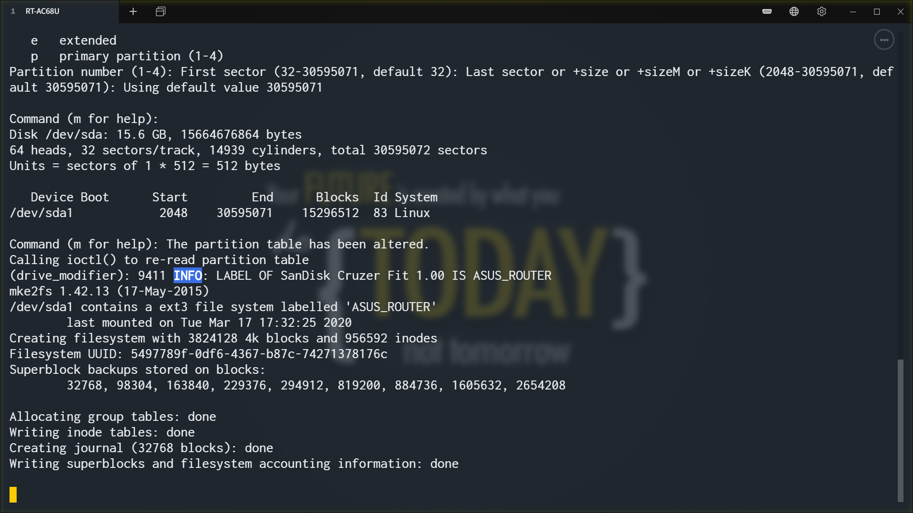

   - Download files for installation.

     

   - Create log of installation.

     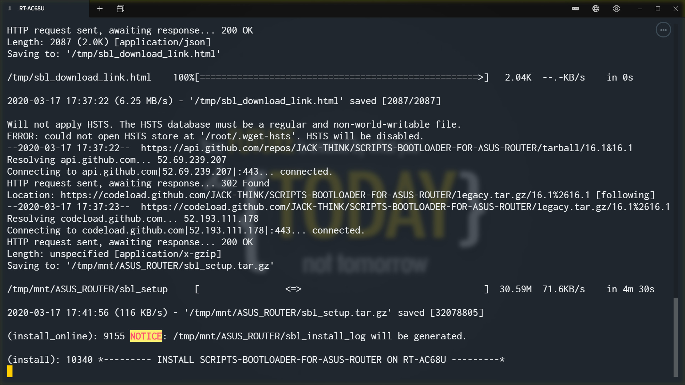

   - **STAGE 1**: Set the router.

     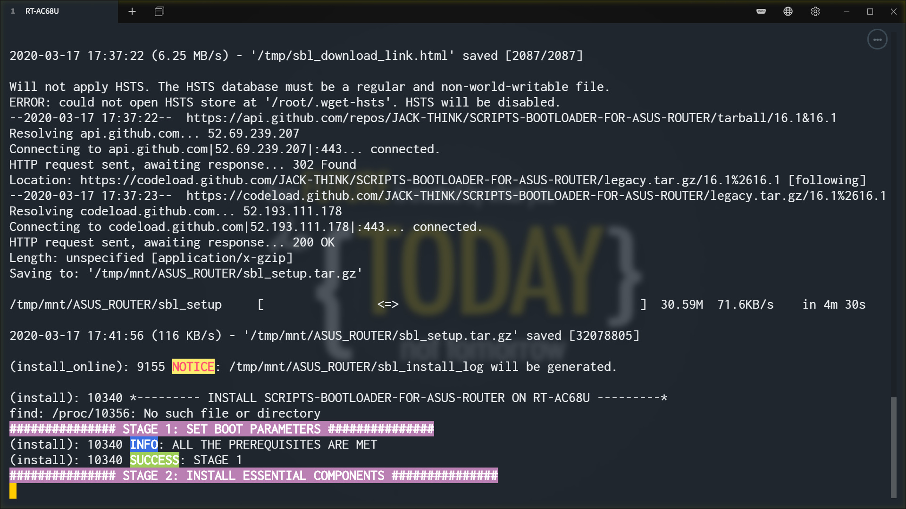

   - **STAGE 2**: Install the requisite components.

     - Install and enable component swap (512M).

       

     - Install and enable component entware.

       

     - Install and enable component timezone.

       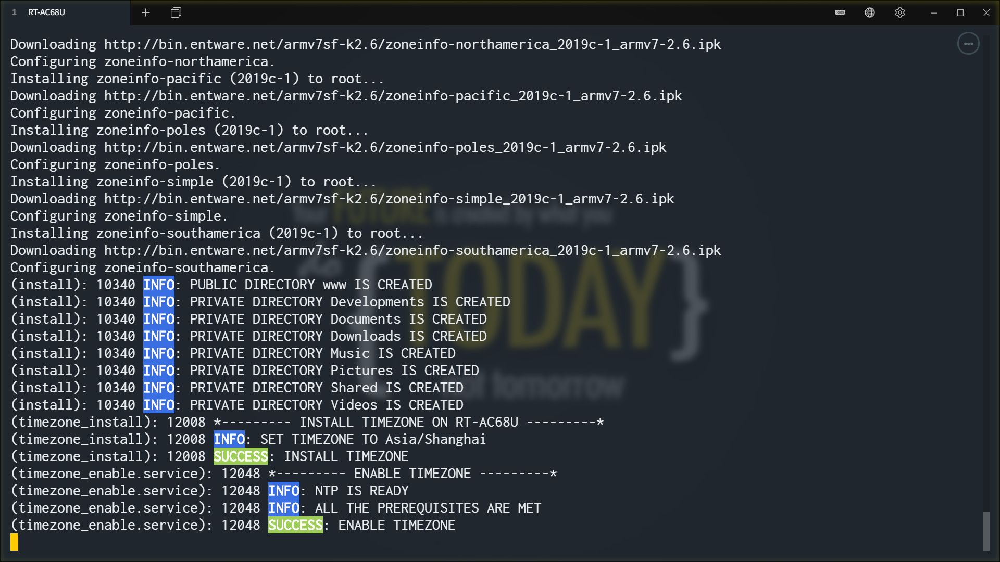

     - Install and enable component dependency.

       > It's OK even if some yellow characters show up on the screen.

       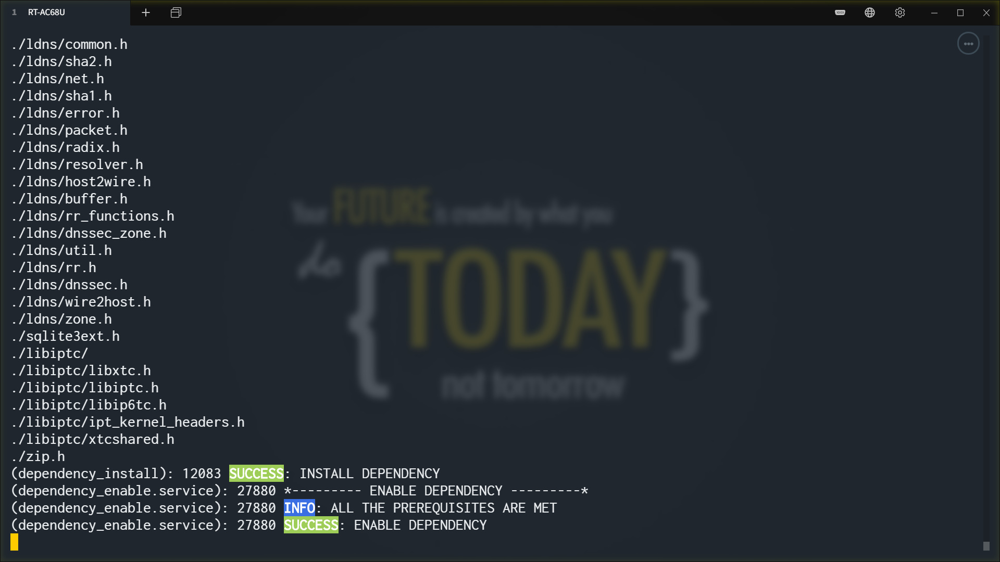

     - Install and enable component monit.

       

     - Install and enable component dnsmasq.d.

       

     - Install component fwd.

       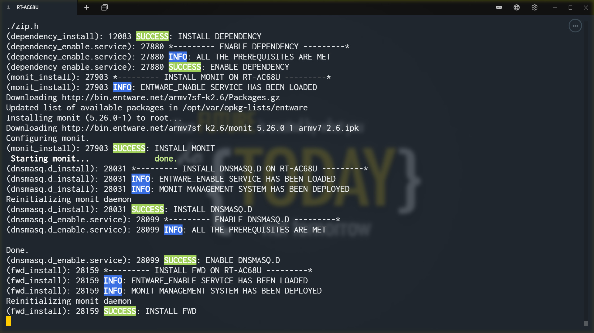

     - Register user costum components which need no surveillance.

       

     - STAGE 2 completed

       

   - **STAGE 3**: Install the optional components (the add-ons).

     - Input the index number of the favored add-on according to the menu.

       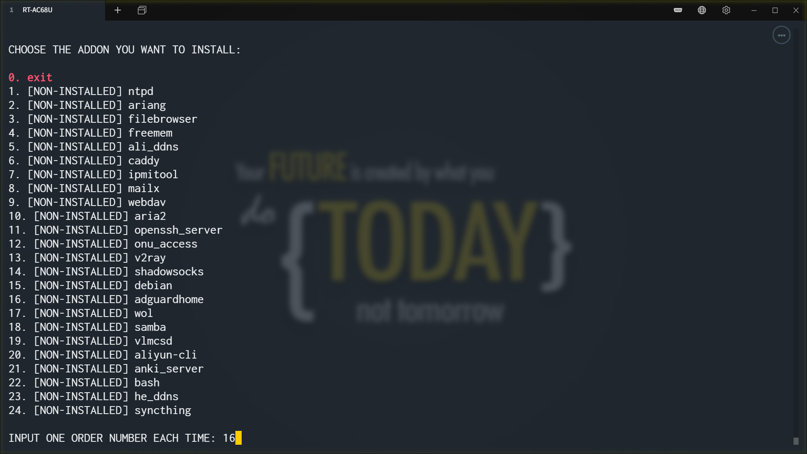

     - When the previous add-on has been installed successfully, install the next add-on.

       

     - Input `0` to exit the installation and reboot the router after all the favored add-ons are installed.

       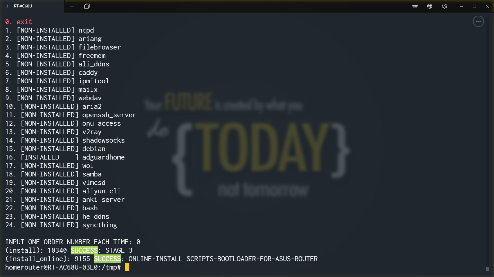

## Installation (Manual)

1. Insert a USB flash drive with no files into a USB port of the Router.

2. Login the router with ssh client.

3. Download the latest installation package from Github and upload it to `/tmp/home/root` of the router.

   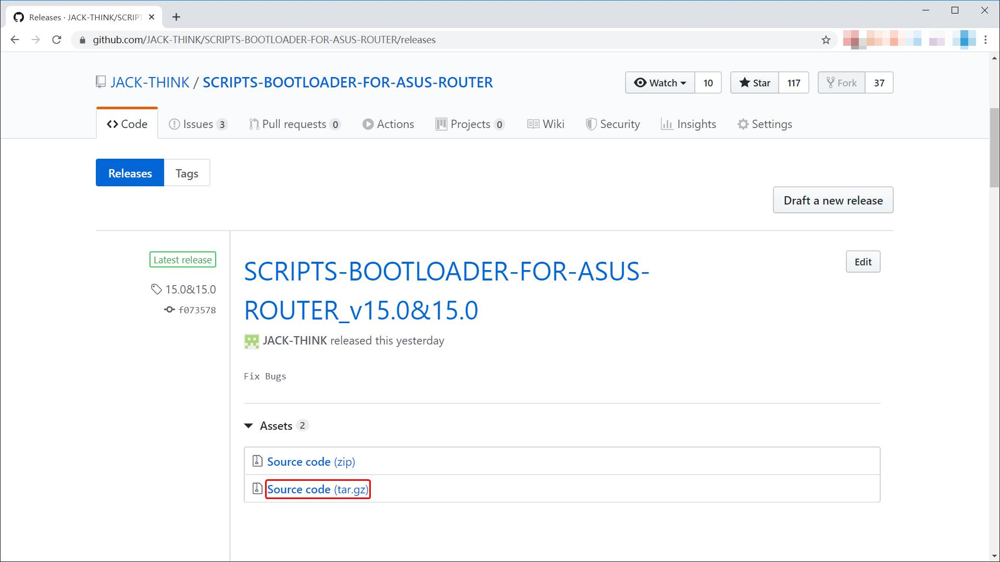

4. Execute the code below to unzip the installation package.

   ```shell
   cd /tmp/home/root
   tar -xzvf SCRIPTS-BOOTLOADER-FOR-ASUS-ROUTER-15.0-15.0.tar.gz
   rm -f SCRIPTS-BOOTLOADER-FOR-ASUS-ROUTER-15.0-15.0.tar.gz
   ```

5. Execute the code below to move the files and change their rights.

   ```shell
   mv SCRIPTS-BOOTLOADER-FOR-ASUS-ROUTER-15.0-15.0/script_bootloader/ ./
   rm -rf SCRIPTS-BOOTLOADER-FOR-ASUS-ROUTER-15.0-15.0/
   chmod -R 777 script_bootloader/
   cp script_bootloader/bin/prerequisite_checker /tmp/
   cp script_bootloader/bin/drive_modifier /tmp/
   cd /tmp
   ```

6. Execute the code below to check the environment. Everything goes well if the output is nothing.

   ```shell
   /tmp/prerequisite_checker
   ```

7. Execute the code below to re-partition and format the USB flash drive.

   ```shell
   /tmp/prerequisite_checker
   ```

8. Execute the code below to move the files.

   ```shell
   mv /tmp/home/root/script_bootloader /tmp/mnt/ASUS_ROUTER/
   ```

9. Execute the code below to start installation.

   ```shell
   /tmp/mnt/ASUS_ROUTER/script_bootloader/bin/install
   ```

10. (Optional) If command `tee` doesn't exist in the firmware, installation will come to an end after outputing `***** STAGE 3: INSTALL ADDONS *****`. Execute the code below to install add-ons.

   ```shell
   /tmp/mnt/ASUS_ROUTER/script_bootloader/bin/install
   ```

11. Execute the code below to reboot the router after all the favored add-ons are installed.

   ```shell
   reboot
   ```

## Modification to source files

Modify the source files of the target add-on according to the README_en-US.md in its own directory in `/opt/script_bootloader/usr/`.

> **NOTICE**
>
> - LF needs to be set in Windows before you edit the source files. Otherwise the files will be damaged.
> - NO extra setting is required in Linux before you edit the source files.

## Enable/Disable add-ons

> Add-on Management system is composed of 2 parts below.
>
> | Add-on Management system    | Type of add-ons                                            | Instruction                                                    |
> | --------------------------- | ---------------------------------------------------------- | -----------                                                    |
> | list_of_user_custom_scripts | Add-ons which run at startup with no surveillance required | Read the instruction below.                                    |
> | Monit                       | All add-ons except the type listed above                   | [Click to read](./script_bootloader/usr/monit/README_en-US.md) |

1. Login the router with ssh client.

   

2. Execute the code below to edit list_of_user_custom_scripts.

   ```shell
   vim /opt/script_bootloader/bin/list_of_user_custom_scripts
   ```

   

   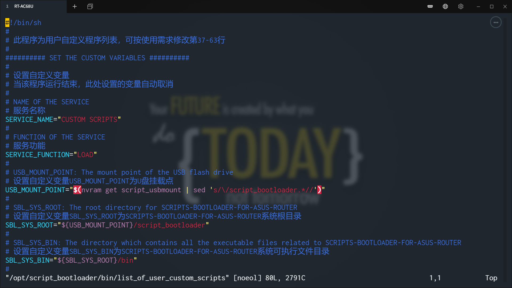

3. Enable/Disable the target add-ons.

   - Enable add-ons: Remove the `#` at the start of the path to target add-ons.
   - Disableadd-ons: Insert a `#` at the start of the path to target add-ons.

   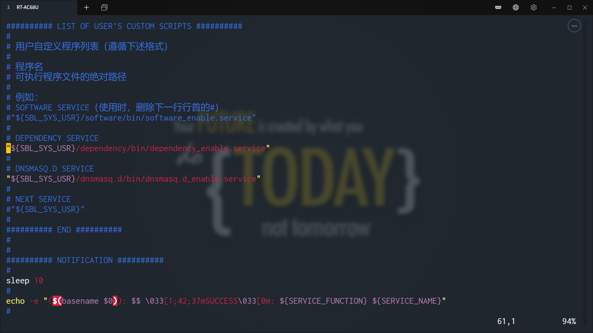

4. Save and exit.

   \<ESC\>→\<:\>→\<w\>→\<q\>→\<Enter\>

5. Execute `reboot` and all the favored add-ons will boot along with the router.

   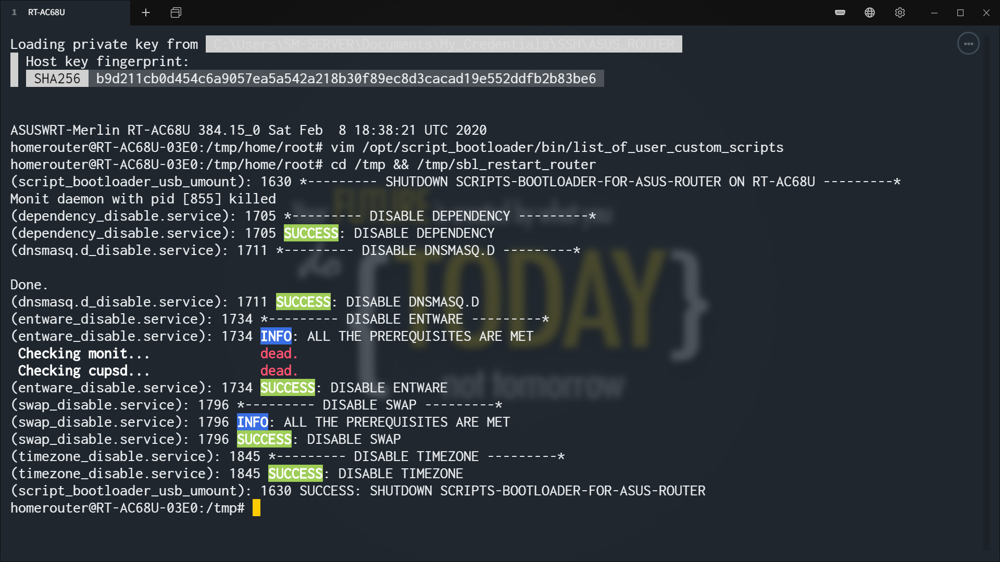

## Update

1. Login the router with ssh client.

   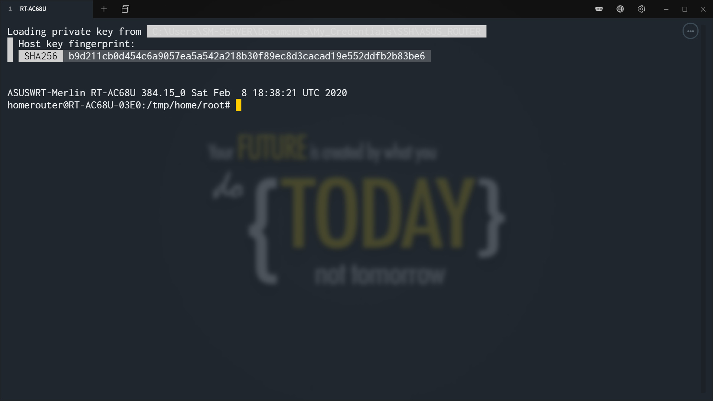

2. Execute the code below to update the system.

   ```shell
   cd /tmp && /tmp/mnt/ASUS_ROUTER/script_bootloader/bin/update
   ```

   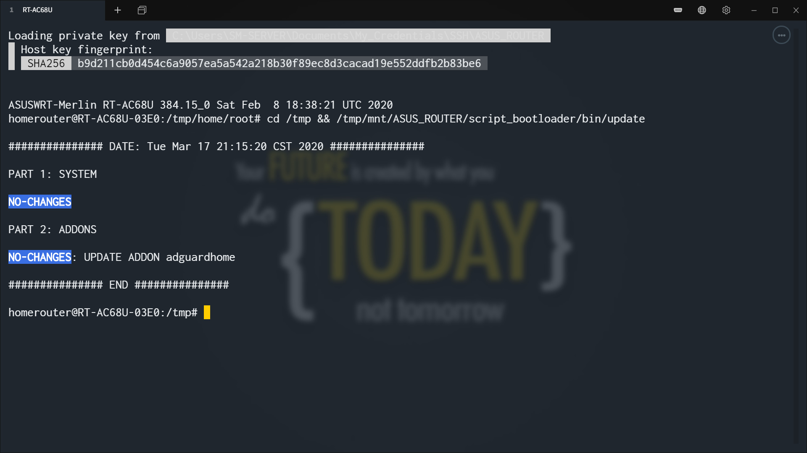

## Uninstallation

1. Login the router with ssh client.

   

2. Execute the code below to uninstall the system.

   ```shell
   cd /tmp && /tmp/mnt/ASUS_ROUTER/script_bootloader/bin/uninstall
   ```

   

## Restoration

> You have to unplug the USB flash drive containing the system from the router before upgrade the firmware of the router every time. After the upgradation is OK, re-plug the USB flash drive containing the system to a USB port of the Router.

1. Login the router with ssh client.

   

2. Execute the code below to restore the system.

   ```shell
   cd /tmp && /tmp/mnt/ASUS_ROUTER/script_bootloader/bin/restore
   ```

   

## Reinstallation or Upgradation

1. [Uninstall](#Uninstallation) the system.

2. [Install](#installation-online) the system again.